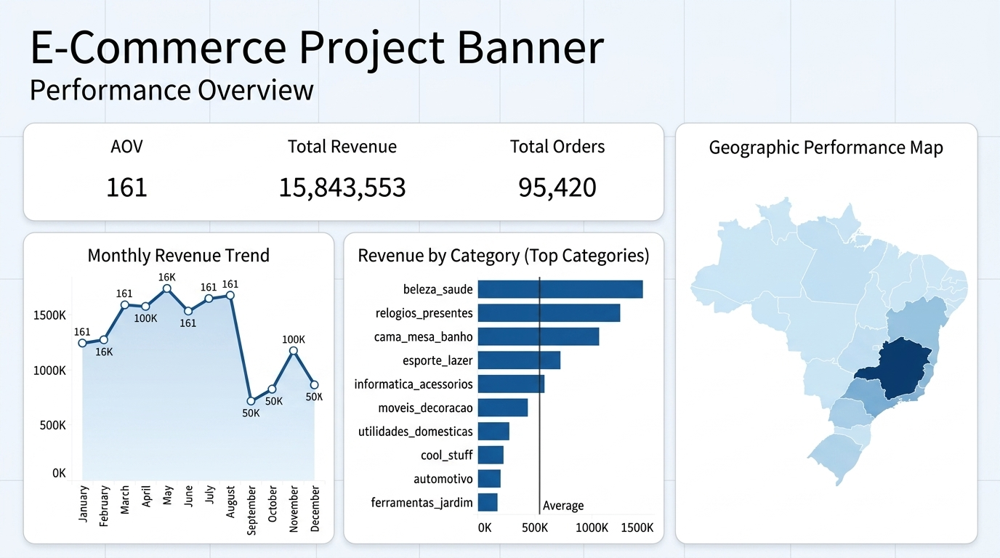
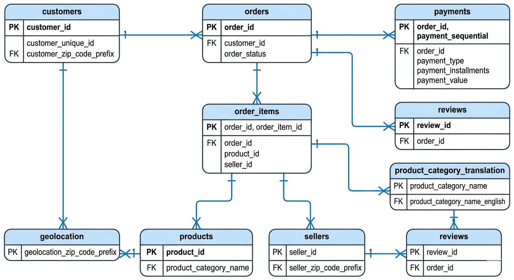
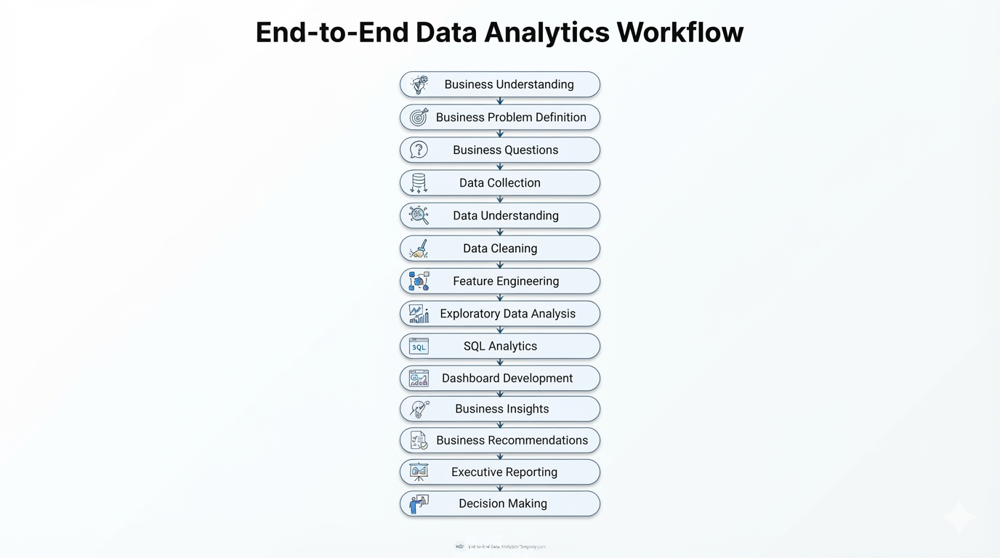
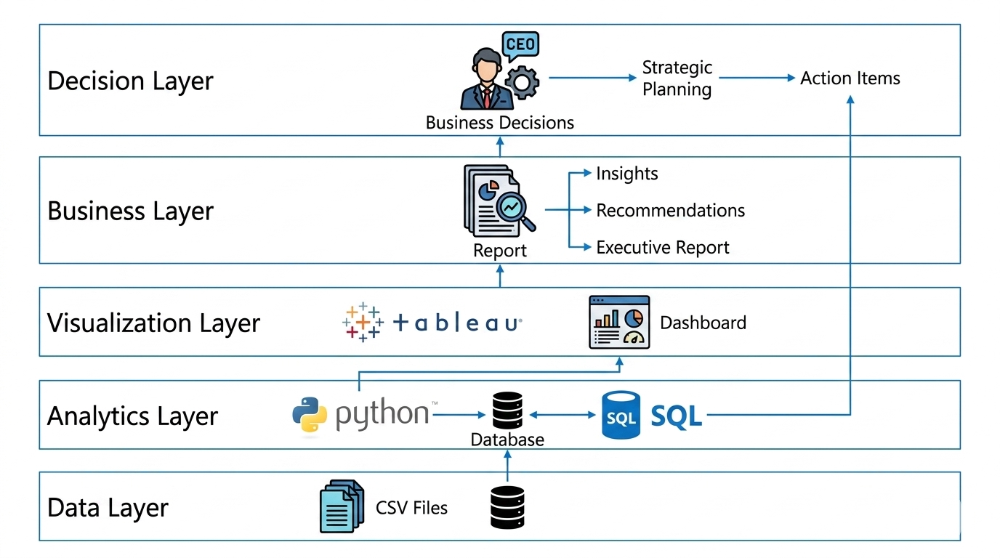
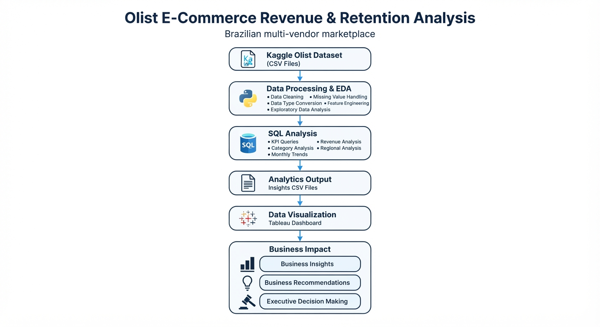

<div align="center">



# Olist E‑Commerce Revenue & Retention Analysis
### A Revenue Diagnostics Engagement for a Brazilian Multi‑Category Marketplace

**End‑to‑end analytics engagement — Python → SQL → Tableau → Executive Reporting**

[](https://www.python.org)
[](https://www.mysql.com/)
[](https://pandas.pydata.org/)
[](https://www.tableau.com/)
[](./LICENSE)
[]()

**[📊 Live Dashboard](https://public.tableau.com/views/OlistDashboard_17723869461260/Dashboard2)** · **[🗃️ SQL](./sql)** · **[🐍 Python](./python)** · **[📖 Documentation](./docs)** · **[📑 Executive Report](./reports/Executive_Report.md)** · **[🎤 Presentation](./Presentation/Olist-Analytics-Insight.pptx)**

</div>

---

## 📑 Quick Navigation

<table>
<tr>
<td valign="top" width="33%">

**Business**
- [Executive Summary](#-executive-summary)
- [Business Background](#-business-background)
- [Business Problem](#-business-problem)
- [Business Objectives](#-business-objectives)
- [Stakeholders](#-stakeholders)
- [Business Questions](#-business-questions)

</td>
<td valign="top" width="33%">

**Data & Analysis**
- [Dataset Overview](#-dataset-overview)
- [Data Model](#-data-model)
- [Data Quality Assessment](#-data-quality-assessment)
- [Methodology](#-methodology)
- [SQL Analytics](#-sql-analytics)
- [Python Analytics](#-python-analytics)
- [KPI Library](#-kpi-library)

</td>
<td valign="top" width="33%">

**Deliverables**
- [Dashboard](#-dashboard)
- [Business Insights](#-business-insights)
- [Recommendations](#-business-recommendations)
- [Reports](#-reports)
- [Presentation](#-Presentation)
- [Documentation](#-documentation)
- [Repository Structure](#-repository-structure)

</td>
</tr>
</table>

---

## 🧭 Executive Summary

> **Prepared for:** Olist leadership (Sales, Marketing, Finance, Operations) · **Prepared by:** Mohammad Ammar — Data Analyst · **Period covered:** Full transaction history in the Olist public dataset (2016–2018)

Olist, a Brazilian marketplace connecting small and medium merchants to consumers nationwide, generated **R$15.8M** in revenue across **95,420 orders**, at an average order value of **R$160.58**. Revenue rose through the first half of the year, peaked, and then declined — a pattern consistent with recurring seasonality rather than a demand collapse.

This engagement traces that performance from raw order data through Python‑based cleaning and feature engineering, SQL‑based KPI extraction, and an interactive Tableau dashboard — and converts the findings into a prioritized, owned set of business recommendations rather than a chart pack.

### Key KPIs

| Metric | Value |
|---|---|
| 💰 Total Revenue | **R$15,843,553.24** (~R$15.8M) |
| 📦 Total Orders | **95,420** |
| 🧾 Average Order Value (AOV) | **R$160.58** |
| 🏷️ Product Categories Analyzed | **74** |
| 🗺️ States Analyzed | **27** |
| 🥇 Top Category | beleza_saude — R$1.44M (9.1% of revenue) |
| 🌎 Top State | São Paulo (SP) — R$5.92M (37.4% of revenue) |

### Key Findings

1. **Growth has a seasonal ceiling.** Revenue climbs through Q2, peaks in **May (R$1.74M)**, and declines to a trough in **September (R$0.72M)** — a recurring, plannable cycle rather than a one‑off dip.
2. **Category revenue is concentrated.** The top 3 categories account for **~25%** of revenue and the top 5 for **~39%**, out of 74 categories tracked.
3. **Geographic revenue is concentrated.** The top 3 states (SP, RJ, MG) account for **~63%** of revenue, led by São Paulo alone at **~37%**.
4. **Retention, not acquisition, is the weakest link.** The large majority of customers purchase once and do not return, making new‑customer acquisition the primary — and more expensive — growth engine.

### Executive Conclusion

Olist's near‑term growth is more exposed to **concentration risk** (a handful of states and categories) and **repeat‑purchase weakness** than to underlying demand — and both are addressable without new markets, new inventory, or new capital. See [Business Recommendations](#-business-recommendations) for the prioritized action plan.

---

## 🏢 Business Background

**Industry:** E‑commerce marketplace / retail‑enablement, within Brazil's broader online retail sector.

**Business model:** Olist is a marketplace‑enablement platform. It does not manufacture or hold its own inventory — it connects independent sellers across Brazil to buyers through major online retail channels, handling listings, order routing, logistics coordination, and customer communication on sellers' behalf. This makes it closer to a **multi‑tenant platform business** (revenue spread across many independent merchants) than a traditional single‑brand retailer.

**How the business operates:**

```
Seller lists product on Olist  →  Customer places order (may span sellers)
        →  Olist coordinates fulfillment & logistics  →  Delivery
        →  Post‑delivery satisfaction survey / review
```

**Revenue model:** Revenue is aggregated across many small sellers rather than concentrated in a few large accounts, so growth is structurally tied to **breadth** (how many categories and regions are active) and **repeatability** (whether buyers return) — rather than to deepening a relationship with a small set of large accounts.

**Why this analysis matters:** A marketplace of this shape carries three structural exposures that a single‑brand retailer often doesn't:
- **Category concentration risk** — no flagship product to fall back on if demand in leading categories shifts.
- **Geographic concentration risk** — local disruptions in a dominant state have outsized revenue impact.
- **Retention risk** — a growth model built on constantly acquiring new one‑time buyers is structurally more expensive than one built on repeat engagement.

---

## ❗ Business Problem

Leadership has reliable top‑line numbers (revenue, order count, AOV) but no structured, repeatable view of:

1. **Where** revenue actually comes from at the category and regional level, and how concentrated it is.
2. **Who** is generating it — new customers or repeat customers — and in what proportion.
3. **When** demand predictably rises and falls, and whether planning currently accounts for it.

### Decisions currently blocked

| Function | Cannot currently... |
|---|---|
| Marketing | Confidently allocate incremental budget across categories/regions without a concentration and growth‑rate view |
| Customer Success | Size or justify a retention program without a validated repeat‑purchase rate |
| Finance | Forecast with confidence without knowing how much revenue sits in a small number of categories/states |
| Operations | Plan staffing/inventory around seasonality without a documented, recurring pattern |

### Risk summary

| Risk | Description | Why it's urgent |
|---|---|---|
| Concentration risk | Majority of revenue tied to a small set of categories and states | A localized disruption has an outsized effect on total revenue |
| Retention risk | Majority of customers purchase once | Growth depends on continuously replacing the customer base — costlier than retaining it |
| Planning risk | Seasonal peak/trough is real but undocumented as a standing pattern | Inventory/staffing decisions risk being reactive rather than planned |

*Existing reporting (a static revenue total) answers "how much," but not "where," "who," or "when" — the three questions this engagement is built to close.*

---

## 🎯 Business Objectives

| Business Objectives | Technical Objectives |
|---|---|
| Identify where revenue is structurally concentrated (category, region) and quantify exposure | Build modular SQL queries against the Olist schema, organized by business module |
| Determine whether growth is driven by new‑customer acquisition, repeat purchasing, or both | Perform documented, reproducible cleaning & feature engineering in Python |
| Establish a documented, recurring seasonal pattern Operations/Marketing can plan around | Produce an interactive Tableau dashboard for non‑technical, self‑serve stakeholder access |
| Deliver prioritized, ownable recommendations leadership can fund and track this quarter | Document methodology, KPI definitions, and data lineage for full auditability |

**Success metrics:** adoption of the KPI dashboard as a standing monthly review; measurable movement in Repeat Purchase Rate after the retention campaign; category/state revenue‑share trending less concentrated over time. **Expected outcome:** a shared, queryable source of truth replacing intuition‑based category, regional, and retention decisions.

---

## 👥 Stakeholders

| Stakeholder | Primary Interest | Key Question This Analysis Answers |
|---|---|---|
| **CEO** | Growth durability & enterprise risk | Is growth durable, and where's the exposure? |
| **Sales** | Where to focus effort this quarter | Which categories/regions should the team prioritize? |
| **Marketing** | Spend allocation & retention | Where should budget move to convert one‑time buyers into repeat buyers? |
| **Finance** | Forecasting confidence | How concentrated is revenue, and what's the downside risk? |
| **Operations** | Staffing & capacity planning | What does the seasonal order‑volume pattern look like? |
| **Supply Chain** | Inventory allocation | Which categories/regions need inventory attention? |
| **Customer Success** | Retention program design | Where exactly is retention weakest, and how big is the gap? |

A single dashboard trying to serve everyone tends to satisfy no one — this project is built so each stakeholder above can go directly to the KPI, query, or dashboard view that answers their specific question. See [`docs/05_Stakeholders.md`](./docs/05_Stakeholders.md) and [`docs/11_KPI_Definitions.md`](./docs/11_KPI_Definitions.md) for the full stakeholder‑to‑KPI mapping.

---

## ❓ Business Questions

Every question below is traceable to the query or artifact that answers it.

<details>
<summary><b>Sales, Revenue & AOV</b></summary>

1. What is total revenue, order volume, and AOV, and how have they trended month over month? → `sql/02_monthly_revenue.sql`
2. How does AOV vary by category and by region? → derived from `sql/03_category_revenue.sql` + `sql/04_state_city_revenue.sql`
3. What is the AOV trend over time, independent of volume? → `sql/02_monthly_revenue.sql`
4. What does the order‑volume‑to‑revenue ratio suggest about category pricing? → `sql/03_category_revenue.sql`

</details>

<details>
<summary><b>Category</b></summary>

5. Which product categories generate the majority of revenue (Pareto concentration)? → `sql/03_category_revenue.sql`
6. Are there high‑volume, low‑revenue categories (low‑value, high‑frequency)? → `sql/03_category_revenue.sql`
7. Which categories are growing vs. declining relative to the prior period? → **Open** — needs period‑over‑period comparison, not yet queried
8. How exposed is total revenue to underperformance in the top 3 categories? → derived from `sql/03_category_revenue.sql`

</details>

<details>
<summary><b>Region</b></summary>

9. Which states/regions contribute the most and least revenue? → `sql/04_state_city_revenue.sql`
10. How exposed is total revenue to underperformance in the top 3 states? → derived from `sql/04_state_city_revenue.sql`
11. Which regions are under‑represented relative to population and could be under‑penetrated? → **Open** — requires external population data not in this dataset

</details>

<details>
<summary><b>Growth & Seasonality</b></summary>

12. Is there a seasonal pattern to order volume, and when does it peak/trough? → `sql/02_monthly_revenue.sql`
13. What is the single highest‑volume month, and what preceded it? → `sql/02_monthly_revenue.sql`

</details>

<details>
<summary><b>Customer & Retention</b></summary>

14. Is revenue growth driven by new customers, repeat customers, or both? → **Open** — requires a customer‑order join not currently in `sql/`
15. What percentage of customers are repeat purchasers? → Partially answered qualitatively; recommend adding `sql/repeat_purchase_rate.sql`
16. What would a 10% improvement in repeat‑purchase rate mean directionally? → **Open by design** — flagged as a scenario exercise, not a hard projection, to avoid invented figures

</details>

<details>
<summary><b>Executive</b></summary>

17. Where should marketing budget move first based on category concentration? → insight synthesis, see [Business Insights](#-business-insights)
18. Which KPIs should leadership track monthly vs. quarterly? → [`docs/11_KPI_Definitions.md`](./docs/11_KPI_Definitions.md)
19. What data quality issues limit confidence in category or regional figures? → [Data Quality Assessment](#-data-quality-assessment)
20. What is the minimum viable retention initiative addressing the biggest identified gap? → [Business Recommendations](#-business-recommendations)

</details>

> **On "Open" items:** these are genuine, honestly‑stated gaps rather than glossed‑over ones. Several are picked up directly in the two related repositories — see [Related Projects](#-related-projects). Full table with status: [`docs/06_Business_Questions.md`](./docs/06_Business_Questions.md).

---

## 🗂️ Dataset Overview

| | |
|---|---|
| **Source** | [Olist Brazilian E‑Commerce Public Dataset](https://www.kaggle.com/datasets/olistbr/brazilian-ecommerce) (Kaggle) — not redistributed here due to size |
| **Period** | 2016–2018 |
| **Granularity** | One row per order item (an order with 3 products yields 3 rows); every revenue KPI sums line‑level values rather than counting rows |
| **Raw tables ingested** | `olist_customers`, `olist_geolocation`, `olist_order_items`, `olist_order_payments`, `olist_orders`, `olist_products` (6 CSVs) |
| **Core tables used in SQL/insights** | `orders`, `order_items`, `customers`, `products`, `payments` |

**Data quality at a glance:** no major missing‑value issues in the core `orders` / `order_items` / `products` join for the fields used here. One structurally important nuance: `customer_id` is generated **per order**, while `customer_unique_id` persists across orders for the same real customer — any repeat‑purchase or retention metric must use `customer_unique_id` (see [Data Quality Assessment](#-data-quality-assessment)).

**Limitations:** time‑bounded (2016–2018, not current‑day performance) · geolocation is zip‑code‑prefix level, not exact address · anonymized identifiers, so no demographic/firmographic enrichment is possible from this dataset alone.

📄 Full column‑by‑column dictionary: [`docs/data_dictionary.md`](./docs/data_dictionary.md)

---

## 🧩 Data Model

<div align="center">

</div>

```
customers (1) ──< (many) orders (1) ──< (many) order_items >── (1) products
                                    │
                                    └──< (many) payments
                                    └──< (0..1) order_reviews
order_items >── (many) ── (1) sellers
```

- **customers → orders:** one customer (by `customer_unique_id`), many orders
- **orders → order_items:** one order, many line items
- **products → order_items:** one product, many line items across orders
- **sellers → order_items:** one seller, many line items
- **orders → payments:** an order can have multiple payment records (e.g., split payments)
- **orders → order_reviews:** an order has zero or one review

> **Key gotcha:** `customer_id` is generated per order in the public dataset; `customer_unique_id` is the correct join key for any repeat‑purchase or retention analysis. Full entity/field spec: [`docs/09_Data_Model.md`](./docs/09_Data_Model.md).

---

## 🔍 Data Quality Assessment

| Area | Finding |
|---|---|
| Missing values | No major missing‑value issues in the core join used for revenue/category/regional KPIs |
| Duplicates | Revenue KPIs sum at the order‑item grain to avoid double‑counting orders |
| Identifier integrity | `customer_id` resets per order; `customer_unique_id` is the correct retention/repeat‑purchase key — this is the single most important data‑quality caveat in the schema |
| Geolocation precision | Zip‑code‑prefix level, not exact address — state/city conclusions are reliable, hyper‑local ones are not |
| Cleaning applied | Category translation (Portuguese → English via the translation table), date parsing, revenue rollups (`price + freight_value`) — see [`python/README.md`](./python/README.md) |
| Confidence | High confidence in revenue, order, category, and regional KPIs; retention/repeat‑purchase figures should be re‑verified against `customer_unique_id` before being cited externally |

---

## 🔬 Methodology

<div align="center">

</div>

```
Business Understanding
        ↓
Data Understanding (schema, relationships, quality)
        ↓
Cleaning & Feature Engineering (Python)
        ↓
Exploratory Data Analysis (Python)
        ↓
KPI & Business-Question SQL (sql/)
        ↓
Visualization (Tableau)
        ↓
Business Insights
        ↓
Recommendations
```

Business understanding comes first deliberately — every downstream step (which columns matter, which KPIs to build, which chart to make) is a consequence of the business questions above, not the other way around. This avoids the common failure mode of exploring the data first and retrofitting a business story to whatever was found.

| Stage | Tool | Why |
|---|---|---|
| Cleaning & feature engineering | Python / Pandas | Flexible for joins, category translation, reusable transformation logic |
| KPI & business‑question queries | SQL | Set‑based aggregation is the natural fit for revenue/order rollups, and is directly portable to a production warehouse |
| Visualization | Tableau | Interactive, filterable access for non‑technical stakeholders |
| Documentation | Markdown | Version‑controlled alongside the analysis, auditable in the same repository |

**Reproducibility:** (1) download the Olist dataset from Kaggle, (2) run the Python cleaning steps in [`python/README.md`](./python/README.md), (3) run the queries in [`sql/`](./sql) against the cleaned tables, (4) open the Tableau workbook or the live dashboard link. No step depends on undocumented manual work.

---

## 📊 Exploratory Data Analysis

EDA is performed in [`python/EDA.py`](./python/EDA.py) and documented step‑by‑step in [`python/README.md`](./python/README.md). Each analysis exists to answer one of the [Business Questions](#-business-questions) above, not as a generic exploratory pass:

- **KPI validation** — baseline revenue, orders, customers, and AOV computed programmatically in Pandas as a cross‑check against the SQL layer.
- **Top‑10 product analysis** — identifies the highest‑revenue individual products.
- **Category revenue ranking** — feeds directly into the Pareto/concentration finding in [Business Insights](#-business-insights).
- **Delivery delay diagnostics** — computes the delta between estimated and actual delivery dates to flag fulfillment friction (`is_delayed` flag), an operational finding that sits alongside the core revenue/retention analysis.

---

## 🗄️ SQL Analytics

All queries live in [`sql/`](./sql), each scoped to one business module so it can be run and audited independently. Revenue is computed consistently across every query as **`price + freight_value`**.

| # | File | Business Module | Answers | Decision Supported |
|---|---|---|---|---|
| 1 | [`01_sales_kpis.sql`](./sql/01_sales_kpis.sql) | Core KPIs | Total revenue, total customers, AOV | Executive/Finance top‑line tracking |
| 2 | [`02_monthly_revenue.sql`](./sql/02_monthly_revenue.sql) | Time | Monthly revenue trend & seasonality | Inventory & staffing planning |
| 3 | [`03_category_revenue.sql`](./sql/03_category_revenue.sql) | Product | Category‑level revenue ranking | Category prioritization, marketing spend |
| 4 | [`04_state_city_revenue.sql`](./sql/04_state_city_revenue.sql) | Regional | State‑ and city‑level revenue distribution | Regional expansion, logistics planning |

**Query design notes** (from [`sql/query_index.md`](./sql/query_index.md)):
- `01_sales_kpis.sql` uses a CTE to pre‑aggregate line‑level financials per order before computing global totals — preventing inflated counts from the order‑item grain.
- `02_monthly_revenue.sql` extracts month from `order_purchase_timestamp` and sorts chronologically to expose seasonality.
- `03_category_revenue.sql` joins `products` to `order_items` and ranks categories descending by gross revenue.
- `04_state_city_revenue.sql` joins `customers → orders → order_items` and aggregates at both state and city grain.

Full technical write‑up (engine notes, schema assumptions, dialect portability): [`sql/README.md`](./sql/README.md)

---

## 🐍 Python Analytics

[`python/EDA.py`](./python/EDA.py) is the cleaning, feature‑engineering, and diagnostic script that runs upstream of the SQL layer.

| Step | What it does | Business interpretation |
|---|---|---|
| **Ingestion** | Loads the 6 raw Olist CSVs (customers, geolocation, order items, payments, orders, products) | Establishes a single unified analytical frame |
| **Integration** | Left‑joins on `customer_id`, `order_id`, `product_id` | Builds the join‑ready table the SQL layer and dashboard depend on |
| **Feature engineering** | Derives `total = price + freight_value` | Standardizes the revenue definition used everywhere downstream |
| **KPI validation** | Computes total revenue, total orders, total customers, AOV in Pandas | Cross‑checks the SQL‑layer KPIs before they reach the dashboard |
| **Top‑10 product ranking** | Groups and sorts by `product_id` revenue | Surfaces individual best‑selling products beneath the category level |
| **Category revenue ranking** | Groups and sorts by `product_category_name` | Feeds the Pareto/concentration finding |
| **Delivery delay analysis** | `order_delivered_customer_date − order_estimated_delivery_date` → `is_delayed` flag | Surfaces fulfillment friction as an operational risk alongside revenue/retention findings |
| **Visualization** | `matplotlib` bar chart of Top‑10 categories by revenue | Rapid exploratory assessment ahead of the Tableau dashboard build |

Prerequisites, execution steps, and a full narrative walkthrough: [`python/README.md`](./python/README.md)

---

## 📐 KPI Library

| KPI | Formula | Business Meaning | Decision Supported | Primary Stakeholder |
|---|---|---|---|---|
| Total Revenue | Σ(order item price + freight value) | Top‑line health indicator | Growth forecasting | CEO, Finance |
| Total Orders | Count of unique customer/order transactions | Demand / volume signal | Staffing and capacity planning | Operations |
| Average Order Value (AOV) | Total Revenue ÷ Total Orders | Pricing and basket‑size health | Pricing and promotion decisions | Sales, Marketing |
| Category Revenue Share | Category Revenue ÷ Total Revenue | Concentration risk indicator | Category prioritization, inventory allocation | Sales, Supply Chain |
| State Revenue Share | State Revenue ÷ Total Revenue | Geographic concentration risk | Regional expansion / marketing spend | Marketing, Finance |
| Monthly Revenue Trend | Revenue grouped by order month | Seasonality detection | Inventory and staffing planning | Operations |
| Repeat Purchase Rate | Customers with 2+ orders (by `customer_unique_id`) ÷ Total Customers | Retention health | Retention program sizing and investment | Customer Success, Marketing |

**Reporting cadence:** Revenue / Orders / AOV — monthly (Finance, Sales leadership) · Category & State Revenue Share — quarterly, or after a major marketing shift (Marketing) · Repeat Purchase Rate — quarterly (Customer Success).

**Known edge cases:**
- Repeat Purchase Rate must use `customer_unique_id`, not `customer_id`, or the one‑time‑buyer rate will be overstated.
- AOV is computed at the order level (revenue ÷ distinct orders), not the line‑item level, to avoid understating true order value on multi‑item orders.
- Category Revenue Share can be skewed by a small number of high‑price outlier items; a secondary median‑price view is recommended if a category's average looks unrepresentative.

Full version with edge cases and stakeholder mapping: [`docs/11_KPI_Definitions.md`](./docs/11_KPI_Definitions.md)

---

## 📈 Dashboard

<div align="center">

</div>

**[🌐 View Interactive Dashboard on Tableau Public](https://public.tableau.com/views/OlistDashboard_17723869461260/Dashboard2)**

**Audience:** Sales, Marketing, and Executive leadership. **Purpose:** self‑serve view of revenue trend, category mix, and regional distribution without needing to run SQL. **Decisions supported:** category prioritization, regional budget allocation, monthly performance review.

### Dashboard walkthrough

| Zone | Component | What it shows |
|---|---|---|
| Top banner | KPI tiles | Total Revenue, Total Orders, AOV — immediate top‑line health |
| Bottom‑left | Monthly revenue trend line | Seasonality — the May peak and September trough at a glance |
| Bottom‑center | Category revenue bar chart with average benchmark line | Which categories sit above/below the portfolio average — the Pareto view |
| Right pane | Brazil choropleth map | Revenue and order density by state — the geographic concentration view |

**Interactivity:** all panes act as bidirectional filters — selecting a state updates category rankings and monthly trend to that region; selecting a category filters the geographic distribution and monthly velocity accordingly.

Full field‑level mapping (which UI element maps to which SQL/Pandas field): [`dashboard/dashboard_dictionary.md`](./dashboard/dashboard_dictionary.md) · Design rationale and layout zones: [`dashboard/README.md`](./dashboard/README.md)

---

## 💡 Business Insights

Each insight follows **finding → why it matters → what it implies**, not description alone. Full text with supporting detail: [`docs/12_Business_Insights.md`](./docs/12_Business_Insights.md).

### 1. Growth has a ceiling under current conditions
Revenue climbed steadily into Q2, peaked in **May (R$1.74M)**, then declined to a trough in **September (R$0.72M)** before a modest Q4 recovery. Read in isolation, the decline looks like a demand problem; read against the monthly pattern, it's consistent with recurring seasonality. **Implication:** treat the mid‑year peak as a plannable event for inventory, staffing, and marketing timing — not a one‑off surprise.

### 2. The business is running a concentrated bet, not a diversified one
The top 3 of 74 categories generate **~25%** of revenue, and the top 5 generate **~39%**, led by *beleza_saude* (beauty & health, R$1.44M). That's an efficient allocation of attention in a stable environment, but it means the top line moves with a small number of categories. **Implication:** a category‑diversification watchlist reduces single‑point‑of‑failure exposure, not just "adds variety."

### 3. Geographic revenue is similarly concentrated
The top 3 states — **São Paulo, Rio de Janeiro, Minas Gerais** — generate **~63%** of revenue, with São Paulo alone accounting for **~37%**. This is a structural, not incidental, dependency: a logistics disruption, competitive entrant, or regional economic shift in the top state has a materially larger effect on total revenue than the same disruption in a smaller state. **Implication:** regional diversification should be evaluated as risk‑hedging, with success measured by exposure reduction, not just incremental revenue.

### 4. Retention, not acquisition, is the weakest link
The majority of customers purchase once and do not return. Current revenue is therefore substantially a function of continuously acquiring new customers — a growth engine that is more expensive and less durable than one built on repeat engagement, since acquisition cost recurs every period while retention cost amortizes. **Implication:** of the four findings, this is the one where a modest, low‑cost intervention has the clearest, fastest line to durable impact.

**What these insights are not:** none of them claim a specific dollar impact if addressed — see [`docs/14_Limitations.md`](./docs/14_Limitations.md) for why no financial projection is invented here, and what would be required to responsibly produce one.

---

## 🚀 Business Recommendations

Each recommendation states **what, why (linked to an insight), timeframe, and owner** — a recommendation without an owner and a timeframe is an observation, not a plan. Full detail and prioritization logic: [`docs/13_Business_Recommendations.md`](./docs/13_Business_Recommendations.md).

### Short‑term (0–3 months)
**Launch a targeted repeat‑purchase campaign** (email / retargeting) aimed at customers who purchased exactly once in the recent period.
- **Why:** Directly addresses Insight 4 — the lowest‑cost, fastest‑to‑execute lever, targeting an already‑acquired customer base.
- **Owner:** Marketing, with Customer Success.
- **Success metric:** Repeat Purchase Rate, tracked monthly from launch.

### Medium‑term (3–6 months)
**Build a category‑diversification watchlist.**
- **Why:** Addresses Insight 2 — identifies 2–3 adjacent categories with growth potential to reduce Pareto concentration without abandoning current top performers.
- **Owner:** Sales / Category management, with Supply Chain input.
- **Success metric:** Top‑3 Category Revenue Share trending down as a share of total (not in absolute terms).

**Pilot regional marketing spend in one under‑penetrated state.**
- **Why:** Addresses Insight 3 — tests whether geographic concentration reflects a genuine demand ceiling or an under‑invested marketing gap.
- **Owner:** Marketing, with Finance sign‑off on pilot budget.
- **Success metric:** Revenue growth rate in the pilot state vs. a comparable control state.

### Long‑term (6–12 months)
**Institutionalize this dashboard and KPI set as the standing monthly business review.**
- **Why:** Replaces ad hoc, intuition‑based reporting with a shared, queryable source of truth across CEO, Sales, Marketing, Finance, Operations, Supply Chain, and Customer Success.
- **Owner:** Analytics function, with executive sponsorship.
- **Success metric:** Monthly review cadence sustained for two consecutive quarters without lapsing.

**Prioritization logic:** ordered by speed‑to‑impact vs. cost, not insight number. The short‑term retention campaign requires no new market entry or headcount and targets an already‑acquired customer base — the highest‑confidence, lowest‑risk starting point. The medium‑term items require more coordination and are sequenced after the quick win. The long‑term item is process, not a project — lowest urgency, highest compounding value if adopted.

---

## 📈 Business Impact

This analysis supports leadership decision‑making across five dimensions, **without inventing an ROI figure**:

| Dimension | How this project supports it |
|---|---|
| **Revenue** | Converts a single top‑line number into a category‑ and region‑level view of exactly where revenue is concentrated and exposed |
| **Profitability** | Flags long‑tail, underperforming categories as candidates for bundling or supplier rationalization rather than continued blanket investment |
| **Customer retention** | Quantifies the repeat‑vs‑one‑time buyer imbalance and gives Customer Success a KPI to size and track a retention program against |
| **Operations** | Documents a recurring, plannable seasonal pattern (May peak, September trough) that staffing and inventory planning can be built around |
| **Decision‑making** | Replaces ad hoc, intuition‑driven category, regional, and retention calls with a shared, auditable source of truth |

No recommendation in this repository claims a specific revenue lift — see [`docs/14_Limitations.md`](./docs/14_Limitations.md) for why a fabricated confidence level is deliberately avoided.

---

## 🏗️ Technical Architecture

<div align="center">

</div>

```
Kaggle CSV Export (6 raw tables)
      ↓
Python (cleaning, feature engineering, EDA)  →  python/EDA.py
      ↓
SQL (KPI + business-question queries)        →  sql/
      ↓
Insights layer (extracted CSVs)              →  insights/
      ↓
Tableau Public (interactive dashboard)       →  dashboard/
      ↓
Reports & Executive Presentation             →  reports/, presentation/
      ↓
Markdown documentation (this repository)     →  docs/
```

<div align="center">

</div>

---

## 📦 Deliverables

| Deliverable | Location | Description |
|---|---|---|
| Executive Report | [`reports/Executive_Report.md`](./reports/Executive_Report.md) / [`.pdf`](./reports/Executive_Report.pdf) | Full diagnostic write‑up: KPIs, seasonality, category/geographic concentration, retention, delivery friction, and recommendations |
| Executive Presentation | [`Presentation/`](./Presentation) | 20‑slide board/recruiter‑facing deck covering the same engagement end‑to‑end |
| Interactive Dashboard | [`dashboard/`](./dashboard) | Tableau Public dashboard + static preview + field dictionary |
| SQL Scripts | [`sql/`](./sql) | 4 modular, business‑question‑mapped query files |
| Python Analysis | [`python/`](./python) | Cleaning, feature engineering, EDA, and diagnostic script |
| Data Extracts | [`insights/`](./insights) | Clean CSV outputs (KPIs, monthly, category, state) powering the dashboard |
| Documentation | [`docs/`](./docs) | 15‑document consulting‑style business and technical documentation set |
| KPI Library | [`docs/11_KPI_Definitions.md`](./docs/11_KPI_Definitions.md) | Formulas, decisions supported, edge cases |
| Recommendations | [`docs/13_Business_Recommendations.md`](./docs/13_Business_Recommendations.md) | Short/medium/long‑term action plan with owners and success metrics |

---

## 📄 Reports

| Report | Format | Purpose |
|---|---|---|
| [Executive Report](./reports/Executive_Report.md) | Markdown / [PDF](./reports/Executive_Report.pdf) | The full diagnostic report — macro KPIs, dimensional analysis (temporal, category, geographic), key risks, and strategic recommendations, written for executive leadership |

> This repository's `reports/` folder also contains additional PDF templates (`Management_Report.pdf`, `Client_Summary.pdf`, `Executive_Brief.pdf`) that are **not** specific to the Olist engagement and are excluded from the deliverables above to avoid misrepresenting their content as part of this analysis.

---

## 🎤 Presentation

| Asset | Audience | Purpose |
|---|---|---|
| [`Presentation/Executive_Presentation.md`](./Presentation/Executive_Presentation.md) | Executive board, investors, talent acquisition teams | Markdown source of the slide narrative — snapshot, seasonality, category/regional concentration, retention risk, delivery friction, and a 4‑pillar action roadmap |
| [`Presentation/Olist-Analytics-Insight.pptx`](./Presentation/Olist-Analytics-Insight.pptx) | Same as above | 20‑slide rendered deck version, including dataset foundation, SQL layer, and technology‑stack slides |

---

## 📚 Documentation

Every markdown file in this repository, linked and described:

| File | Description |
|---|---|
| [`docs/01_Executive_Summary.md`](./docs/01_Executive_Summary.md) | Headline findings and recommendation summary for leadership |
| [`docs/02_Business_Background.md`](./docs/02_Business_Background.md) | Who Olist is, its marketplace model, and why the analysis matters |
| [`docs/03_Business_Problem.md`](./docs/03_Business_Problem.md) | The decision‑making gaps this engagement closes |
| [`docs/04_Business_Objectives.md`](./docs/04_Business_Objectives.md) | Business objectives mapped to technical objectives |
| [`docs/05_Stakeholders.md`](./docs/05_Stakeholders.md) | Stakeholder‑by‑stakeholder interest and key questions answered |
| [`docs/06_Business_Questions.md`](./docs/06_Business_Questions.md) | Full 20‑question list with the artifact that answers each, and status |
| [`docs/07_Project_Scope.md`](./docs/07_Project_Scope.md) | What's in scope and explicitly out of scope this phase |
| [`docs/08_Dataset_Overview.md`](./docs/08_Dataset_Overview.md) | Source, granularity, relationships, and data‑quality summary |
| [`docs/09_Data_Model.md`](./docs/09_Data_Model.md) | Full schema, table definitions, cardinalities, and ER diagram spec |
| [`docs/10_Methodology.md`](./docs/10_Methodology.md) | The analytics workflow and why it's ordered this way |
| [`docs/11_KPI_Definitions.md`](./docs/11_KPI_Definitions.md) | KPI formulas, stakeholders, cadence, and known edge cases |
| [`docs/12_Business_Insights.md`](./docs/12_Business_Insights.md) | The four core insights, each as finding → why it matters → implication |
| [`docs/13_Business_Recommendations.md`](./docs/13_Business_Recommendations.md) | Short/medium/long‑term recommendations with owners and prioritization logic |
| [`docs/14_Limitations.md`](./docs/14_Limitations.md) | Data, analytical, and scope limitations stated explicitly |
| [`docs/15_Conclusion.md`](./docs/15_Conclusion.md) | Closing synthesis of what this project demonstrates, technically and in business terms |
| [`docs/data_dictionary.md`](./docs/data_dictionary.md) | Column‑by‑column data dictionary for every core table |
| [`docs/README.md`](./docs/README.md) | Standalone, consulting‑style version of this project's narrative |
| [`docs/01_AUDIT_AND_ROADMAP.md`](./docs/01_AUDIT_AND_ROADMAP.md) | Internal repository audit and phased improvement roadmap used to guide this documentation build‑out |
| [`docs/02_ADDITIONAL_DELIVERABLES.md`](./docs/02_ADDITIONAL_DELIVERABLES.md) | Internal review checklists, diagram specs, and reusable cross‑industry template roadmap |
| [`sql/README.md`](./sql/README.md) | SQL engine overview, query portfolio matrix, and schema/operational notes |
| [`sql/query_index.md`](./sql/query_index.md) | Query‑by‑query logic breakdown: optimization strategy, calculation logic, schema relationships |
| [`python/README.md`](./python/README.md) | Python workflow, prerequisites, and execution instructions |
| [`dashboard/README.md`](./dashboard/README.md) | Dashboard visual architecture, zones, and interactivity design |
| [`dashboard/dashboard_dictionary.md`](./dashboard/dashboard_dictionary.md) | Field‑level mapping from dashboard UI elements to source columns |
| [`insights/README.md`](./insights/README.md) | Description of each extracted CSV deliverable and its verified baseline values |
| [`Presentation/Executive_Presentation.md`](./Presentation/Executive_Presentation.md) | Markdown source of the executive slide deck |
| [`reports/Executive_Report.md`](./reports/Executive_Report.md) | Full executive diagnostic report |

---

## 🗃️ Repository Structure

```
olist-sales-analysis/
├── README.md                        ← you are here
├── LICENSE
├── requirements.txt
├── assets/                          Banner, logo, and social-preview images
│   ├── project-banner.png
│   ├── logo.png
│   └── social-preview.png
├── images/                          Diagram assets referenced throughout docs/README
│   ├── er_diagram.png
│   ├── workflow.png
│   ├── analytics_pipeline.png
│   ├── project_architecture.png
│   └── dashboard_preview.png
├── docs/                            15-document consulting-style documentation set
│   ├── 01_Executive_Summary.md
│   ├── 02_Business_Background.md
│   ├── 03_Business_Problem.md
│   ├── 04_Business_Objectives.md
│   ├── 05_Stakeholders.md
│   ├── 06_Business_Questions.md
│   ├── 07_Project_Scope.md
│   ├── 08_Dataset_Overview.md
│   ├── 09_Data_Model.md
│   ├── 10_Methodology.md
│   ├── 11_KPI_Definitions.md
│   ├── 12_Business_Insights.md
│   ├── 13_Business_Recommendations.md
│   ├── 14_Limitations.md
│   ├── 15_Conclusion.md
│   ├── data_dictionary.md
│   ├── 01_AUDIT_AND_ROADMAP.md
│   ├── 02_ADDITIONAL_DELIVERABLES.md
│   └── README.md
├── sql/                              Modular, business-question-mapped SQL queries
│   ├── 01_sales_kpis.sql
│   ├── 02_monthly_revenue.sql
│   ├── 03_category_revenue.sql
│   ├── 04_state_city_revenue.sql
│   ├── query_index.md
│   └── README.md
├── python/                           Cleaning, feature engineering, and EDA
│   ├── EDA.py
│   └── README.md
├── insights/                         Extracted CSV outputs powering the dashboard
│   ├── KPIS.csv
│   ├── monthly.csv
│   ├── Sale by category.csv
│   ├── State.csv
│   └── README.md
├── dashboard/                        Tableau dashboard assets and documentation
│   ├── Olist sales dashboard.png
│   ├── dashboard_dictionary.md
│   └── README.md
├── Presentation/                     Executive slide deck
│   ├── Olist-Analytics-Insight.pptx
│   └── Executive_Presentation.md
└── reports/                          Client-facing written deliverables
    ├── Executive_Report.md
    └── Executive_Report.pdf
```

---

## 🧠 Skills Demonstrated

<div align="center">

`Business Analysis` · `SQL (CTEs, joins, aggregation)` · `Python` · `Pandas` · `Data Cleaning` · `Feature Engineering` · `Exploratory Data Analysis` · `Data Visualization` · `Tableau Dashboarding` · `Business Intelligence` · `Executive Reporting` · `Stakeholder Communication` · `Technical Documentation` · `Git / GitHub`

</div>

This project demonstrates the ability to move from a raw dataset to a decision — identifying not just *what happened*, but *what it implies, what it risks, and what a leadership team should do about it* in the next two quarters, backed by reproducible SQL and Python.

---

## 🔭 Future Improvements

- Period‑over‑period category growth query (closes open Business Question 7) using window functions (e.g., `LAG()`)
- A standalone `repeat_purchase_rate.sql` query, correctly keyed on `customer_unique_id`
- Forecasting next‑quarter revenue by category/region
- A repeat‑purchase propensity model to target retention spend more precisely
- New‑vs‑repeat customer revenue split, once the customer‑level join is added
- Delivery‑time‑vs‑review‑score correlation analysis (the dataset supports this natively; not yet queried)
- Migrating the dashboard layer to Power BI as a comparison exercise
- Lightweight scheduled‑refresh automation if migrated to a live data source

---

## 🔗 Related Projects

This is the first of a three‑part Olist analytics series:

- **[Cohort Retention Analysis](https://github.com/theammarngp-makes/E-commerce-cohort-retention-analysis)** — a deep dive on the retention gap flagged in Insight 4 above
- **[E‑Commerce RFM Customer Segmentation](https://github.com/theammarngp-makes/ecommerce-rfm-customer-segmentation)** — segment‑level detail behind the "repeat vs. one‑time buyer" finding

---

## ✍️ Author

<div align="center">


**Mohammad Ammar**
Data Analyst — SQL · Python · Pandas · Tableau · Business Analytics

[](https://www.linkedin.com/in/mohammad-ammar-ngp/)
[](https://github.com/theammarngp-makes)

</div>

---

## 📜 License

This project is licensed under the **MIT License** — see [`LICENSE`](./LICENSE) for details.

Dataset: [Olist Brazilian E‑Commerce Public Dataset](https://www.kaggle.com/datasets/olistbr/brazilian-ecommerce) (Kaggle), used under its original license terms — not redistributed in this repository.

---

<div align="center">

**⭐ If you found this project useful, consider giving it a star.**

</div>
